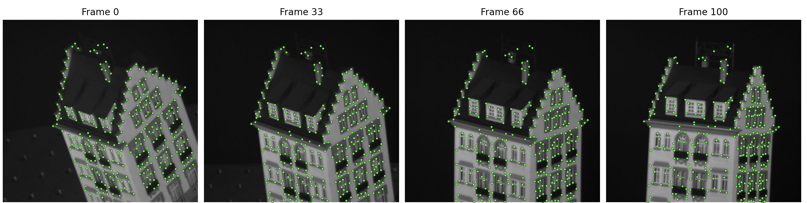
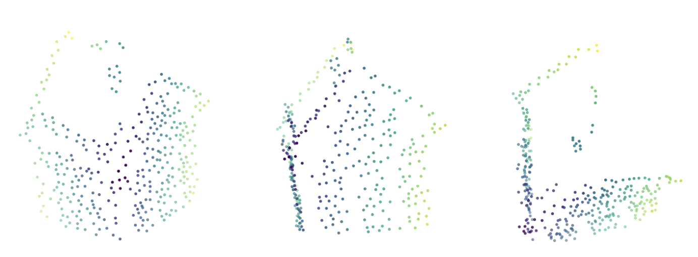
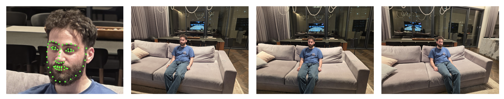
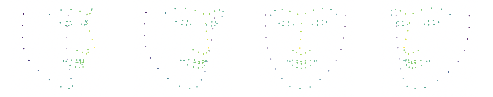

# Rigid Structure from Motion via Factorization

3D reconstruction from 2D image sequences using the Tomasi-Kanade factorization method under orthographic projection.

## Installation

```bash
pip install -r requirements.txt
```

## Usage

`run.py` reconstructs a 3D point cloud from a video file or a directory of images.

### KLT feature tracking (default)

Tracks feature points using KLT optical flow. You will be prompted to draw a bounding box around the object on the first frame.

```bash
# From a directory of images
python run.py data/hotel

# From a video file
python run.py data/sculpture_crop.mp4
```




Optional arguments:

```bash
python run.py data/hotel --max-corners 500 --min-distance 15 --min-visible 0.8
```

| Argument          | Default | Description                                      |
|-------------------|---------|--------------------------------------------------|
| `--max-corners`   | 1000    | Maximum number of feature points to detect        |
| `--quality-level` | 0.01    | Minimum corner quality (relative to best)         |
| `--min-distance`  | 10      | Minimum distance between corners (pixels)         |
| `--min-visible`   | 0.7     | Keep points visible in >= this fraction of frames |

### Face landmark tracking

Tracks 68 facial landmarks using dlib. Requires the shape predictor file (included in the repo but can also be download from [Here](https://sourceforge.net/projects/dclib/files/dlib/v18.10/shape_predictor_68_face_landmarks.dat.bz2/download)).

```bash
python run.py --face data/face_images
```



## Experiments

The Jupyter notebooks in `experiments/` reproduce all results from Parts C and D:

```bash
jupyter notebook experiments/
```
